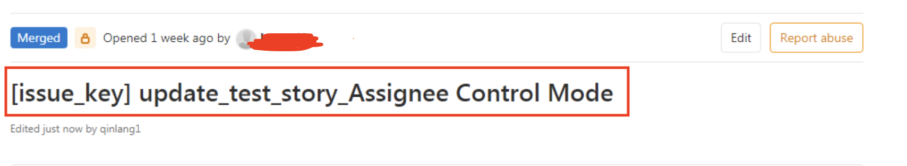
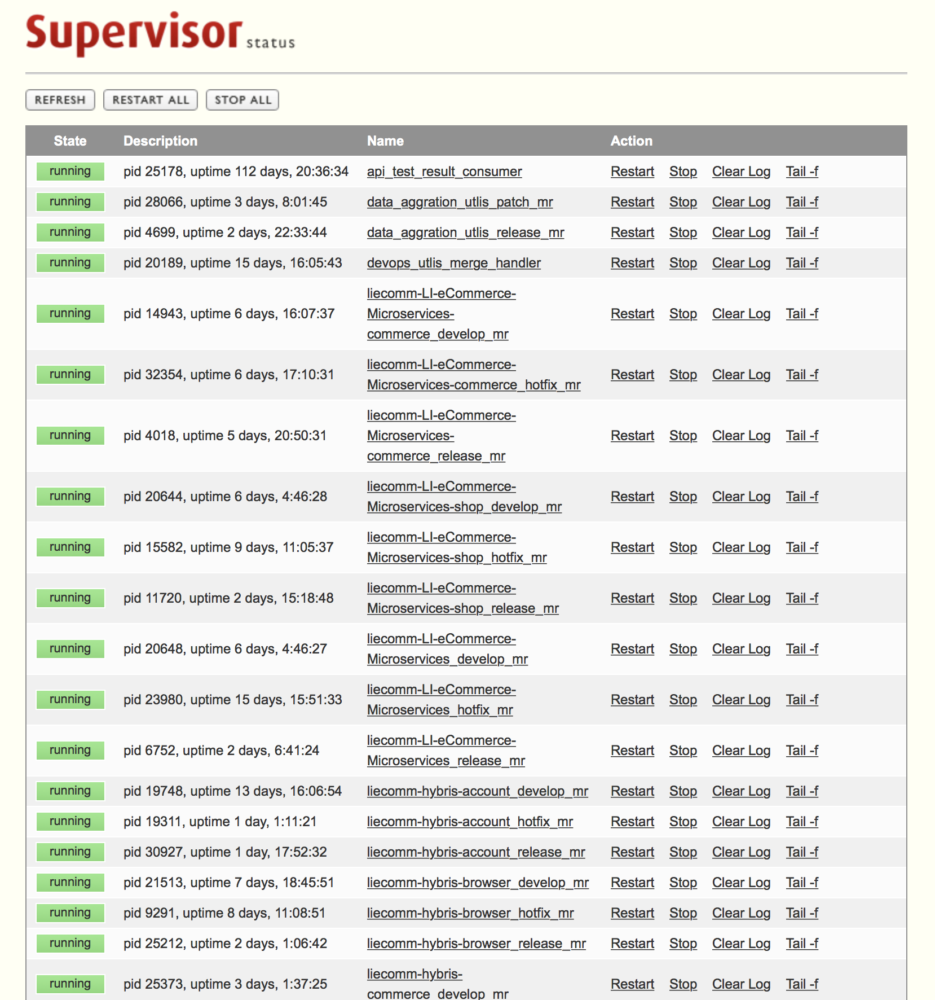
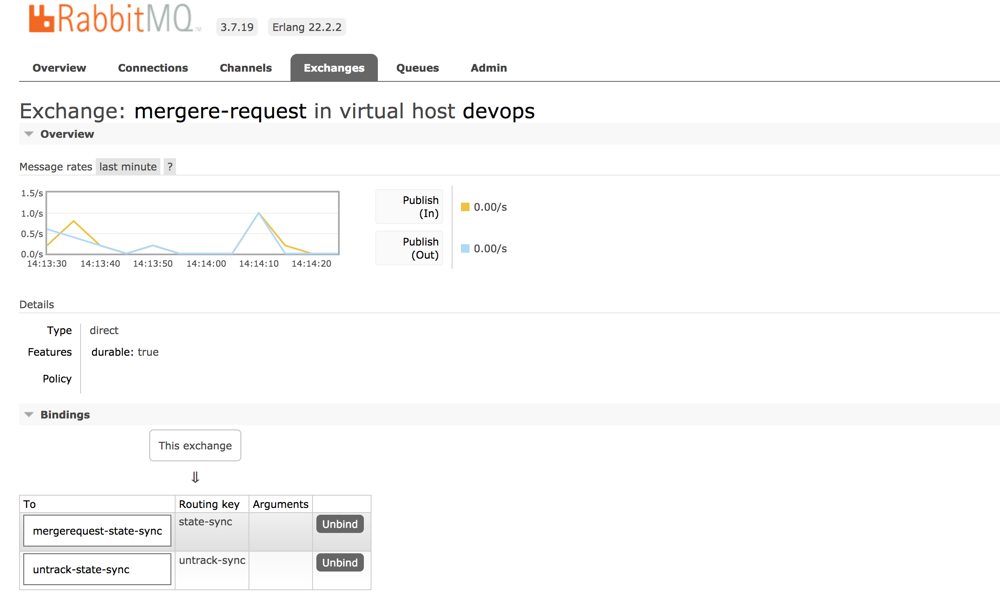

# GitLabMergeController
系统简介：
This is lightweight addon system used to help manage code review and merge process automatically 
这是一个轻量级的外接的系统，用于帮助管理gitlab中大量merge request的 review流程并基于预先定义的模式自动检测merge request的状态并完成代码的merge。
该系统在Merge Request层面上实现了类似Gert的功能，同时对于已有的Git Repository没有任何的侵害，无需做系统的迁移，在控制粒度上可以精准的控制特定的Git Repo
或者特定GitRepo上的特定分支。可以随时在目标分支上Enable或者Disable.

## 概要设计

### 主要功能：
* 该系统通过GitLab API的方式实现对于特定Git Repo或者特定分支中处于Open状态的Merge Request的状态监控和状态最终
* 该系统定义了一套用于描述Merge Request状态监测的配置，使用者可以方便灵活的定义如何对指定的Merge Request进行监测和最终并完成一系列的代码review模式的控制
* 该系统会将Merge Reqeust的实时状态存储在数据库中，便于日后的分析
* 该系统还附带有对于代码修改量的收集/统计/分析功能。由于对于整个Merge Request的生命周期进行了管理，因此可以收集多维度的信息从而实现数据的可视化，以及软件迭代周期工程效率的分析
* 该系统支持接入第三方通知系统，可及时通知预定义好的Auditor 对Merge Request上的操作进行审核

系统整体结构图


### 主要模块：
* Merge Request Control Rule
  yml文件，用于使用者灵活定义 Merge Request的控制逻辑
* Merge Request Handler
  基于定义好的yml 文件，对于制定的git repo中的 MR进行定时的扫描/分析，并对真个代码review的顺序进行管理，并将最新的状态信息发送到Message Queue
* Handler for transfer MQ message to mysql
  持续处理Message Queue中关于Merge Request的最新状态信息，并及时更新数据库
* Handler for handle untracked MR
  后台独立的进程，用于处理那些非正常关闭（不是又control 逻辑完成自动merge）的MR
* Timer for scheduler
  定时器，与Merge Request Handler一起使用，可基于每个GitRepo配置一个，并通过supervisord进行管理，让后台逻辑定时的扫描对应的Git Repo
* Aggregation Utils 
  单独运行的一些小的工具集，用于对存储在数据库中的MR信息进行一些聚合操作，支持后续的数据分析 (可部署成Jenkins Job，定期执行)

## 代码目录结构
* common_utils:  包含了一些utility工具集
* config: 主要存储的是common的配置以及针对于每个git repo的 mr control rule
* gitlab_utils: 这里主要包含着主要逻辑的python脚本
* images: 存储的是这个文档中的图片

## 详细设计
* Merge Request Control Rule
> * 基础配置
```angular2
- projectID: "<replace here with git project id>"   #这里需要填入目标 git project的ID
  projectName: "<replace here with git project name>" #这里需要填入目标 git project的名字
  targetbranch: "release/R.*"       #这里需要填入目标branch的名字，也就是MR的Target分支，同时这里也可以和西面的regularmatchbranch一起使用来决定这里填正则表达式还是固定的分支名
  sourcebranch:                     #这里用来限制监控的MR的source branch，如果不限制的话，这里置空就可以了。
  sourceproject_id_list:            #这里用来限制监控的MR的source git repo,如果之间空某几个特定的git repo提交过来的MR，这里填写对应的Git Repo的 projectID就可以了
  regularmatchbranch: True          #这里是一个控制开关决定上面定义的 'targetbranch' 和 'sourcebranch' 是按照固定内容匹配还是按照正则表达式匹配
  reviewer:
    - <username1>                   #这里是与后续设置的review控制模式中的assigneControl相配合的，这里定义的就是制定的assigne的list。每一个reiver的值都是其在gitlab中的用户名
    - <username2>                    
  auditrecord:                      #这里指定的是Auditor的list，当MR完成review，并自动merge之后，会给这个list中的Auditor发送邮件提醒
    - xxx@test.com
    - xxx1@test.com
    - xxx2@test.com
  notification:                      #在整个自动化扫描分析过程中，可以指定特定的事件然后发送通知邮件给Auditor,这里可以指定具体要发送提醒的事件列表
     - reviewers
     - connotmerge
     - aftermerge
     - mergeconflict
     - cherrypickfailed
     - auditrecord
  compilepass: True                  #在MR提交之后可能会集成了系统预编译的过程，这里用于配置扫描的时候把预编译是否通过也作为衡量MR是否可以merge的一个前提
  automerge: True                    #这里是控制是否执行具体代码merge操作的开关，如果关闭，则该系统主要用于检查MR提交的内容是否合规，而不会自动Merge到主分支
  #mode: "assigneeControl"           #mode参数用来指定当前使用哪种控制逻辑来控制这个MR的审核。目前提供了三种模式可配置
  #mode: "freeApproverCount"
  mode: "mixControl"
  approvalWord: 'Approved'           #这里用于定义关键字，用来判断reviewer是否完成了code审核，也就是说reviewer需要在MR的comments里面提交这个关键字才表名已经完成了代码的审核。
  cherry-pick:                       #这里用于定义代码完成merge之后，是否还需要做相应的cherry pickup提交到其他的分支进行合并。
    targetbranch: "develop"
    enable: False
```
> * 代码Review控制模式

|  Mode名   | 描述  |
|  ----  | ----  |
| freeApproverCount  | MR作者在comments里面通过 "reviewer"关键字定义 reviewer,主要适用于peer reviewe|
| assigneeControl  | 无需额外操作，会根据配置文件中预先定义好的reviewer逐个设置成assignee，主要用在需要严格代码审核的流程中 |
| mixControl  | 该模式是上面两种模式的混合，先支持freeApproveCount模式，然后转入assigneeControl模式，主要支持的场景例如hotfix代码的审核|


> * GitLab中代码审核规范
>> 整个系统的执行需要配合一定的代码审核规范，这个规范用来指导使用者在MR中
>> * Merge Request Title 必须使用[]开头，里面必须填写一个或者多个JIRA ID
>> 
>> * MR的auther需要在MR的 comments里面指定对应的reviewer --可以是一个人，也可以是多个人如下：
   ```angular2
      reviewer: @xxxx1 @xxx2
   ```
>> * Reviewer完成代码的审核之后需要在comments里面回复明确的 "Approved" 关键字（可以在配置文件中配置）
>> 


* Merge Request Handler with timer
```angular2
here is the command to start merge request with timmer
python3 /opt/scripts/devops_utils/gitlab_utils/time_scheduler.py 20  /opt/scripts/devops_utils/config/liecomm-msa-commerce-release_mr.yaml None

here is the command to define supervisord config:
[program:liecomm-msa-commerce_release_mr]
command=python3 /opt/scripts/devops_utils/gitlab_utils/time_scheduler.py 20  /opt/scripts/devops_utils/config/liecomm-msa-commerce-release_mr.yaml None
;autostart=true
;autorestart=ture
stdout_logfile=/home/supervisor/logs/liecomm-msa-commerce_release_mr.log
```
we can use supervisord to manage those thread as below (or you can run them as kubernetes as job):


* Handler for transfer MQ message to mysql
```angular2
启动hanlder执行消费消息队列，并更新MR状态的命令
python3 /opt/scripts/devops_utils/gitlab_utils/merge_handler_mq2mysql.py None

在supervisord中的配置：
[program:mergerequest_my2mysql_job-1]
command=python3 /opt/scripts/devops_utils/gitlab_utils/merge_handler_mq2mysql.py None
;autostart=true
;autorestart=ture
stdout_logfile=/home/supervisor/logs/mergerequest_my2mysql_job-1.log
```

* Handler for handle untracked MR
```angular2
启动Handler处理untracked MR的命令：
python3 /opt/scripts/devops_utils/gitlab_utils/merge_handler_untrack_updatel.py None

在supervisord中的配置：
[program:mergerequest_untrack_update]
command=python3 /opt/scripts/devops_utils/gitlab_utils/merge_handler_untrack_updatel.py None
;autostart=true
;autorestart=ture
stdout_logfile=/home/supervisor/logs/mergerequest_untrack_update.log
```

* Aggregation Utils
1. daily code review comments report
这个脚本用来每天在MR的记录中查询前一天完merge的MR， 并将相关的auther / reviewer / comments / code change等信息以邮件的形式发送给mananger


```angular2
执行该脚本的命令如下：
python3 /opt/scripts/devops_utils/gitlab_utils/reviewe_comments_daily_report.py
```

## 系统部署
### Message Queue 
Message Queue中主要包含一个exchange和两个队列，期间通过exchange key进行了关联(都创建在 devops的 virtualhost下面 )
>> Exchange
>>> mergere-request

>> Queue 
>>> * mergererequest-state-sync (with route key: state-sync)
>>> * untrack-state-sync ( with route key: untrack-sync)

### Redis
Redis 在该系统中主要起到的是缓存非法异常关闭的MR

* 在redis存储的是一个叫做'unTrackMRSet'的集合，集合里面存储的是发现异常关闭的ticket,
* 在每次轮询gitlab的时候，通过比较unTrackMRSet中的值，与实际找到的值做比较，将已经关闭的ticket给剃除出去
* 在set中存储的没一条记录的格式 <MR_ID>-<Project_ID>

### MySQL
* 主要用来存储Merge Request的信息当前信息<br>
* 通过根目录下的数据库文件创建数据库 （ 代码中默认的数据库用户名 root / diet0coke@ , 数据库名: DataAggregation )<br>
* 主要使用的数据库表为 gitlab_merge* 开头的表<br>

## 基于数据的分析
当分支的代码merge的权限由当前服务接管之后，我们可以收集一定的metrics信息例如
* 每个Merge Request的详细信息（提交时间，项目，URL，Auther, Reviewer,....) 
* 当每个MR完成自动merge之后还可以收集整个MR的comments对应的信息 （这部分逻辑实现在了Merge_Handler中,当MR完成自动Merge之后，会统计MR的comment数量）
* 基于MR提交的时间与每个Sprint的开发周期进行匹配，能够获得每个Sprint的MR数据分析

基于上述三项，可进行相应的数据可视化，和数据分析
1. 基于MR的实时更新状态对大量的Git Repo中的MR状态进行可视化展示（下图为内部使用的DevOps dashboard中集成的MR状态展示列表）
   
2. MR对应的comments，实现Reviewer/comments数量的动态展示(可以用于激励reviewer花更多的时间在代码review的工作上)

3. 基于对每个Sprint中MR数据的分析，我们可以针对定义的Merge Request提交的标砖，对每个Sprint中提交的MR进行质量评估

```angular2
这里是按照sprint进行查询MR的SQL例子：
select * from gitlab_merge_request_state where (mr_created_at > "2020-05-25 00:00:00" and mr_created_at < "2020-06-15 00:00:00" and mr_target_branch = "develop" and mr_source_branch != "release/mtp" and mr_source_branch !="develop" and mr_state = "merged") or ((mr_created_at > "2020-06-15 00:00:00" and mr_created_at < "2020-07-07 00:00:00" and (mr_target_branch = "release/mtp" or mr_target_branch="release/R20200707") and mr_state = "merged" )) and mr_target_branch != mr_source_branch and issue_key !="Sync Code" order by mr_created_at
```

## 可优化点
1. 通过GitLab API查询目标git repo的方式会对gitlab本身带来比较大的workload,可以考虑改用gitlab webhook
2. 对于处理untracked mr的逻辑存在并发问题，需要改进
3. 对于merge control rule的配置，需要增加global的配置层去配置一些通用的配置，这样可以减少配置的工作量
4. 提供管理和修改merge control rule的UI
5. 有一些logic需要改成可配置模式(比如对于MR Title的检测)
